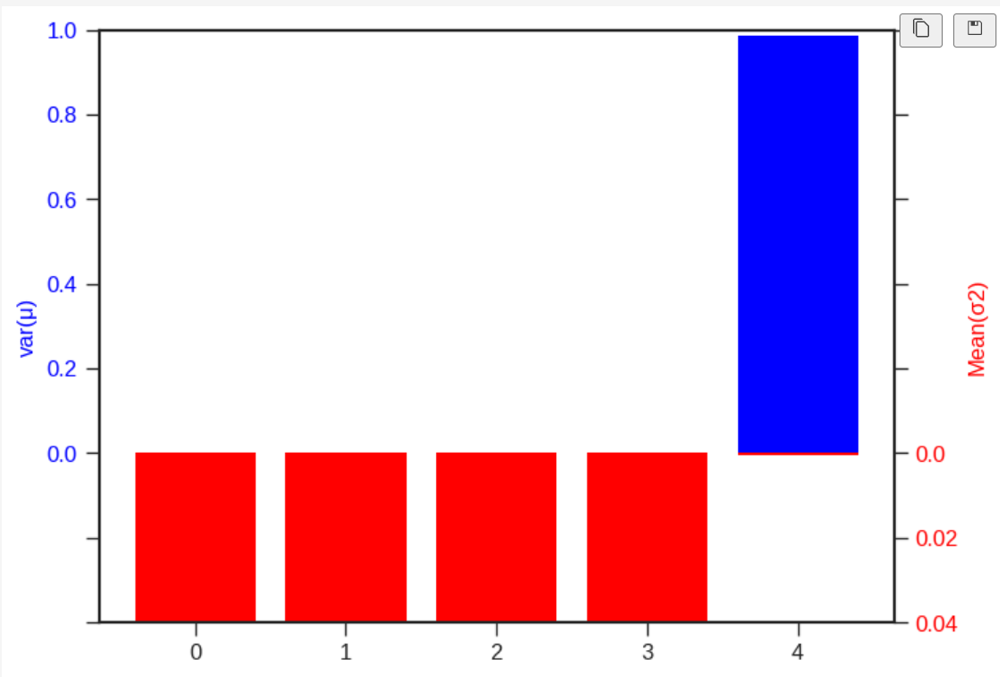

## 
【论文复现】无监督学习——使用VAE提取PDE控制的系统中的可解释的物理参数

## 
[Extracting Interpretable Physical Parameters from Spatiotemporal Systems using Unsupervised Learning](https://arxiv.org/pdf/1907.06011v3.pdf) 
  
## 一、任务解读
&emsp;&emsp; **引言：**实验数据经常受到不受控制的变量的影响，这使得分析和解释变得困难。对于时空系统，其复杂的动力学进一步加剧了这一问题。现代机器学习方法特别适合于分析和建模复杂的数据集，但要在科学上有效，结果需要是可解释的。本篇文章演示了一种无监督学习技术，用于从有噪声的时空数据中提取**可解释的物理参数**，并构建系统的可转移模型。特别是实现了基于**变分自动编码器**的物理嵌入神经网络架构，该架构设计用于分析**由偏微分方程（PDE）控制的系统**。该体系结构被端到端训练，并提取潜在参数，这些参数将系统的学习预测模型的动态参数化。 
&emsp;&emsp; 为了测试该方法的效果，在来自各种PDE的模拟数据上训练模型，这些PDE具有作为不受控变量的变化的动态参数。数值实验表明，该方法可以准确地识别相关参数，并从原始甚至有噪声的时空数据中提取它们（用大约10%的附加噪声进行测试）。这些提取的参数与用于生成数据集的地面真实物理参数有很好的相关性（线性度 $R^2>0.95$ ）。时空系统中可解释的潜在参数的方法将能够更好地分析和理解真实世界的现象和数据集，这些现象和数据往往具有未知和不受控制的变量，这些变量会改变系统动力学，并导致难以分辨的变化行为。 

## 二、数据集和数据获取
&emsp;&emsp; 本文中的数据是由PDE产生的时间序列数据，数据结构一对为时间序列 $(\{x_ t\}_{t=0}^{T_ x}, \{y_ t\}_{t=0}^{T_ y})$ ，其中 $x_{t=0}^{T_ x}$ 为编码器的输入序列， $y_{t=0}^{T_{y}}$ 为提供初始条件的目标序列。本文中共使用两个一维和一个二维PDE产生的时间序列，分别是： 
**（1）1D-Kurmoto–Sivashinsky equation**  

$$\frac{\partial u}{\partial t}=-\gamma \partial_x^4u-\partial_x^2u-u\partial_xu $$

其中$\gamma$是粘度阻尼参数；数据集可由运行下方**脚本** 获取。

~~~shell
# 获取1D Kuramoto-Sivashinsky dataset的脚本
# 1D Kuramoto-Sivashinsky dataset
python VAE/data/generate_KS.py
mv KS_dataset_size5000.npz VAE/data
~~~

 

**（2）1D-nonlinear Schrödinger equation**

$$i\frac{\partial \psi}{\partial t}=-\frac{1}{2}\partial_x^2\psi+\kappa|\psi|^2\psi$$

其中$\kappa$是能量系数；数据集可由运行下方**脚本** 获取 

~~~shell
# 获取1D Nonlinear Schrödinger dataset的脚本
# 1D Nonlinear Schrödinger dataset
python VAE/data/generate_NLSE.py
mv NLSE_dataset_size5000.npz VAE/data
~~~

 

**（3）2D convection–diffusion equation** 

$$\frac{\partial u}{\partial t}=D\nabla^2u-v\cdot \nabla u$$

其中$D$是常数，$v$是速度场的相关对流项；数据集可由运行下方**脚本** 获取 

~~~shell
python VAE/data/generate_CD.py
mv CD_dataset_size1000.npz VAE/data
~~~

## 三、模型介绍
&emsp; &emsp; 使用无监督方法来提取模型关键参数，使用变分自编码器模型（VAE）作为本次实验的模型。VAE由编码器和解码器构成，往往用来提取关键参数信息并进行预测，是无监督学习方法的一个常用的方法。有关VAE的相关知识，可以去学习[北京邮电大学鲁鹏老师的课程](https://www.bilibili.com/video/BV1V54y1B7K3?p=14&vd_source=2cdcfe9c52913dcc5a32a695b1b96162)。 
&emsp; &emsp; 本次实验中，编码器用来提取关键参数（以正态分布的期望和方差形式给出），本次实验中编码器由卷积神经网络搭建；解码器利用编码器提取的参数（其网络的部分权重是由提取的参数所决定的）进行解码，来模拟给定初值条件和边界条件的系统。使用解码器的预测结果与实际结果构建损失函数，以达到**解码器推动编码器提取有用参数的目的**。 
&emsp; &emsp; 论文中VAE的动态编码器（<em>dynamics encoder</em>）是用空洞卷积（<em>dilated conblution</em>）实现的，输入经过一系列卷积后的结果分别经过两个并列的卷积层分别生成待提取参数均值和对数方差（**VAE假定待提取参数服从标准正态分布**）；传递解码器（<em>propagating decoder</em>）是由动态卷积组成，其权重和偏置是由关键参数经过隐藏层生成的，与传统VAE不同本文中的解码器的输入不仅有提取出的关键参数，而且还有初值条件，解码器的输出为预测结果。整个模型的结果如下图所示 
     
 一维模型代码如下：
 ## 四、模型代码实现
&emsp; &emsp; 经过上述讨论，已经对整个VAE有了基本的了解，以**一维模型**为例详细阐述模型的各个模块，具体实现细节由`models/pde1d.py`代码给出

&emsp;&emsp;动态卷积的实现难点在于`torch.Tensor`中的`unfold`方法`paddle.Tensor`没有对应，需要自己实现，下面的`unfold`函数是针对三维和四维张量实现的对应`torch.Tensor.unfold`算子
~~~python
# unfold算子实现
def unfold(x, axis=-2, kernel_size=3, strides=1):
    # print(x.shape)
    if len(x.shape) == 3:
        N = None
        C, H, W = x.shape
        x = x.reshape([1, C, H, W])
    else:
        N, C, H, W = x.shape
    
    kernel_size = [1, kernel_size] if axis==-1 else [kernel_size, 1]
    
    if N is None:
        x = F.unfold(x, kernel_sizes=kernel_size, strides=strides).squeeze_()
        x = x.reshape([C, max(kernel_size), -1])
        x = x.transpose([0, 2, 1])
        x = x.reshape([C, (H-kernel_size[0])//strides+1, (W-kernel_size[1])//strides+1, max(kernel_size)])
    else:
        x = F.unfold(x, kernel_sizes=kernel_size, strides=strides)
        x = x.reshape([N, C, max(kernel_size), -1])
        x = x.transpose([0, 1, 3, 2])
        x = x.reshape([N, C, (H-kernel_size[0])//strides+1, (W-kernel_size[1])//strides+1, max(kernel_size)])
        
    return x
~~~

## 五、训练和测试
&emsp;&emsp;训练和测试的代码如下，实际操作中仍然推荐使用`run.py`脚本对每个数据集分别进行训练和测试。 

### （1）1D-Kurmoto–Sivashinsky方程产生的数据集训练和测试
~~~shell
cd VAE
# 训练
python run.py input_files/KS_train.json
~~~
~~~shell
# 测试
python run.py input_files/KS_test.json
~~~
### （2）1D-nonlinear Schrödinger方程产生的数据集训练和测试
~~~shell
cd VAE
# 训练
python run.py input_files/KS_train.json
~~~
~~~shell
#测试
python run.py input_files/KS_test.json
~~~
### （3）2D convection–diffusion方程产生的数据集训练和测试
~~~shell
cd VAE
# 训练
python run.py input_files/NLSE_train.json
~~~
~~~shell
# 测试
python run.py input_files/NLSE_test.json
~~~
## 六、 结果分析与可视化
&emsp;&emsp;本文中VAE模型进行训练，会产生5个隐藏参数，这个隐藏参数并不一定都是我们想要的可解释的物理参数。可解释的物理参数应该具备如下特点： 
&emsp;&emsp;（1）参数的均值的方差应该足够大； 
&emsp;&emsp;（2）参数方差的均值应该足够小； 
**（1）表明获取的参数应该是可以随着输入不同而变化的；（2）表明参数对自己的取值有足够的信心，波动范围不会很大**；反过来如果获取的参数均值的方差很小，而其方差的均值很大，这就像是对任意的输入，该参数都是取一个差不多的均值，然后用很大的波动范围糊弄过去，这显然是没有可解释的物理意义的。**以非线性薛定谔方程数据集获得的各参数均值和方差为例**，可视化的结果如下： 

 
&emsp;&emsp;上图结果与原文对应的很好，可以解释的参数都是一个，其他方程获得的结果也可以对应的可视化出来，都可以和原文有着很好的对应。原文所有结果如下： 

